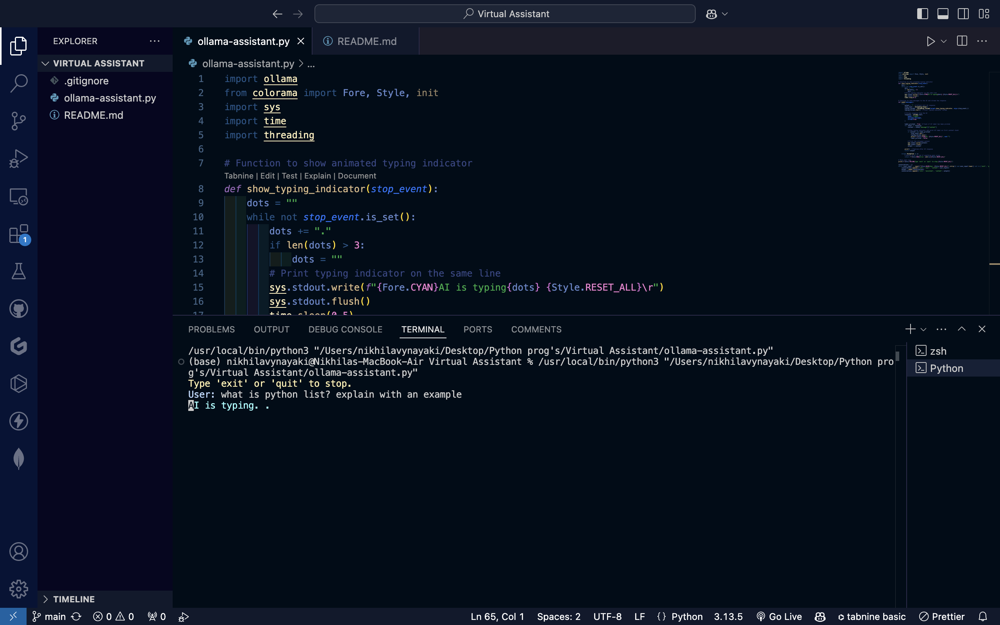
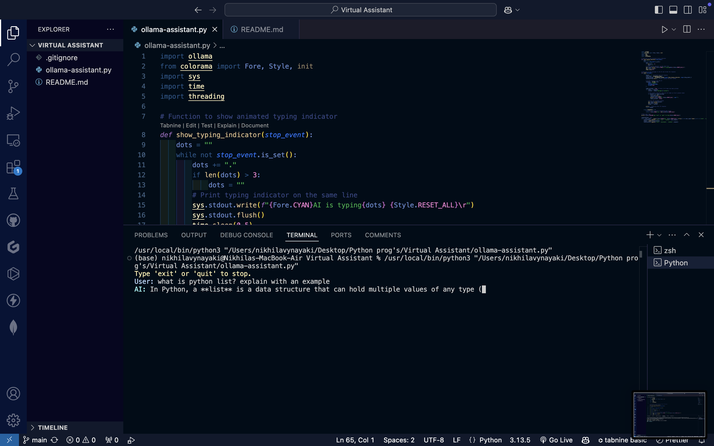

# Ollama Streaming Chatbot

A **Python terminal-based chatbot** powered by [Ollama](https://ollama.com/)’s LLaMA 3 model, featuring **live streaming AI responses** and an **animated "AI is typing..." indicator**. Conversations are stored in memory and displayed in the terminal with color-coded prompts for a clean, interactive experience.

---

## Features

- **Streamed AI Responses**: See the AI’s output appear in real-time, just like modern chat apps.
- **Typing Indicator**: Animated `"AI is typing..."` message while the AI generates a response.
- **Conversation Memory**: Tracks both user and AI messages for context.
- **Color-Coded Terminal Output**: User input, AI responses, and messages are clearly distinguished.
- **Exit Anytime**: Type `exit` or `quit` to stop the chat gracefully.

---

## Demo Screenshot

*This screenshot shows the AI typing indicator in VS Code.*
&ensp;

*This screenshot shows the Ollama chatbot answering a question.*
